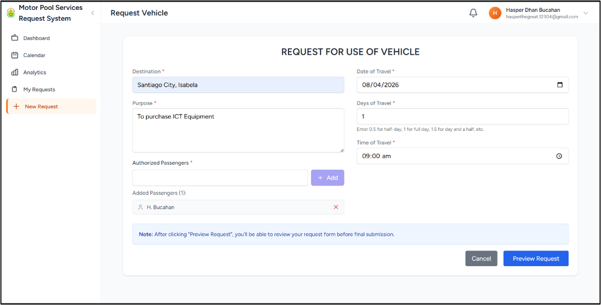
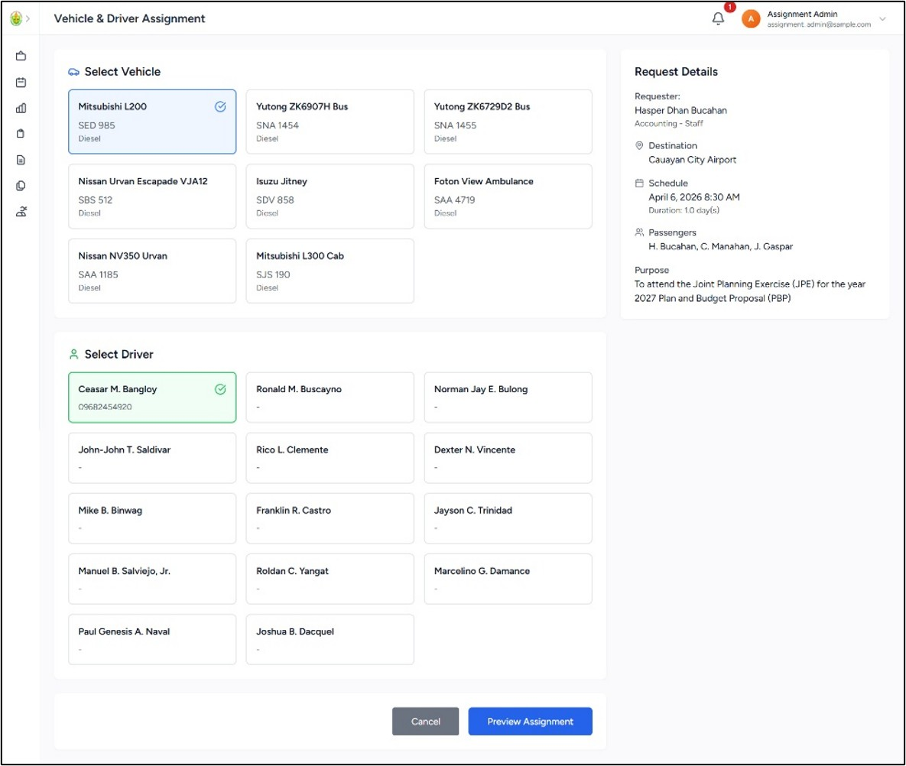
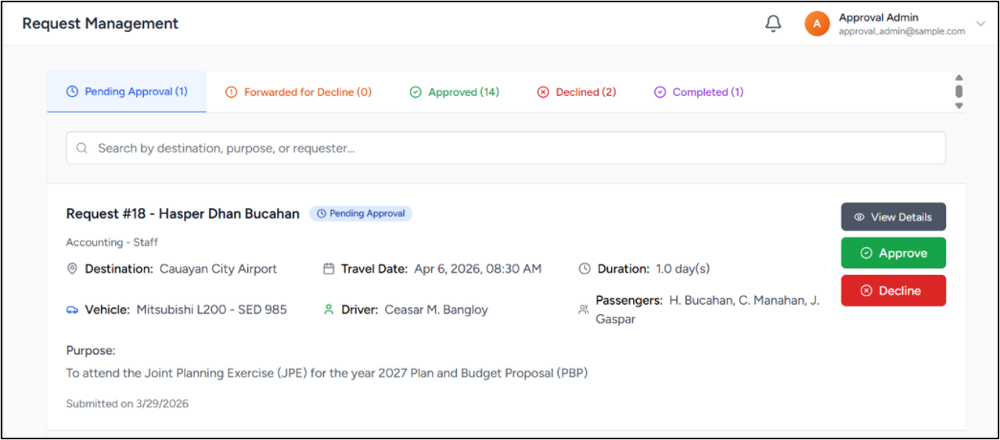
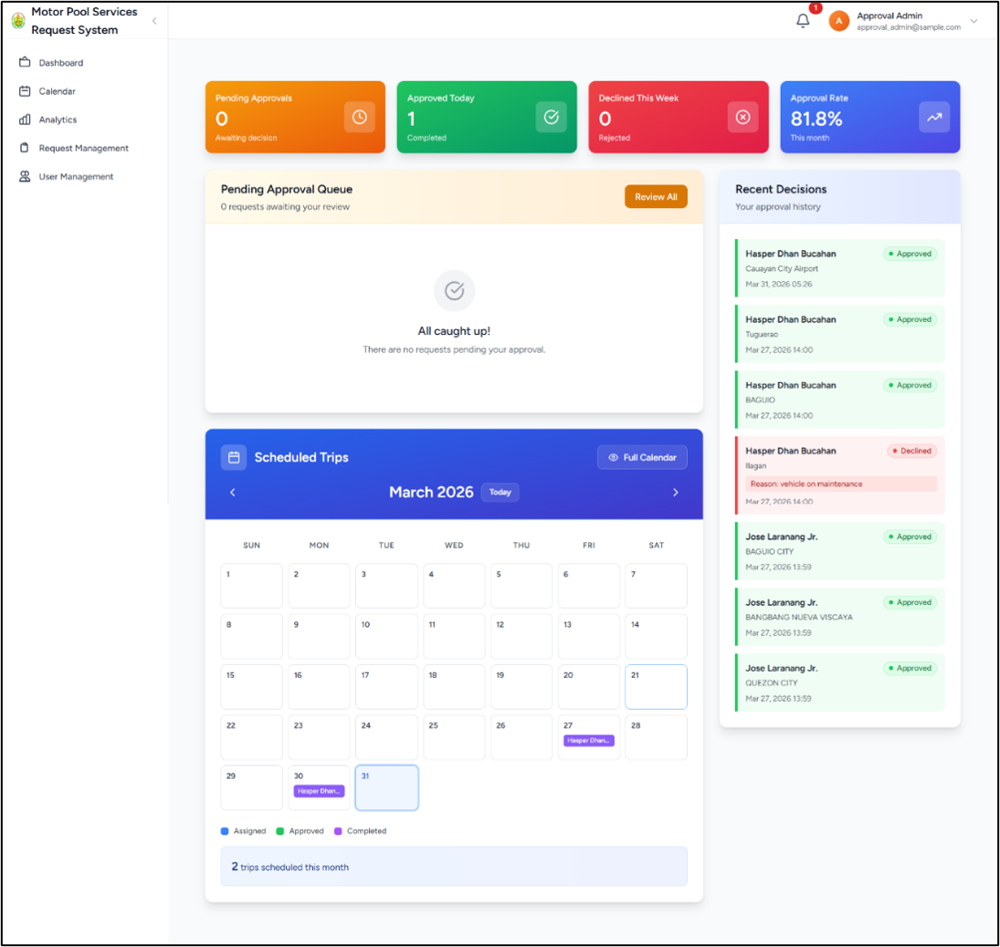
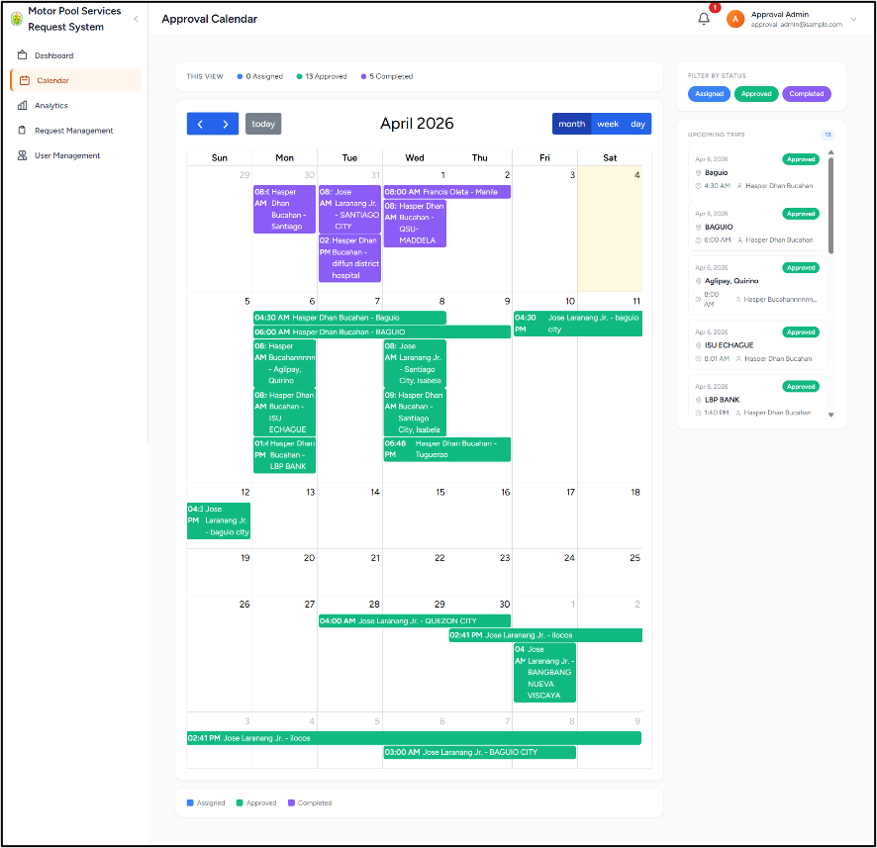
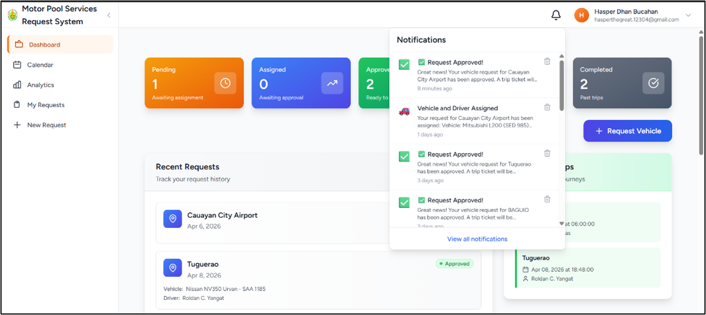
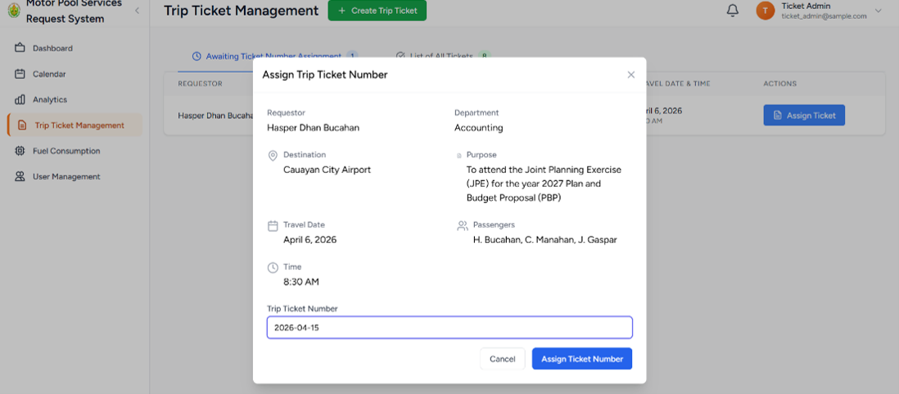

# Web-Based Motor Pool Services Request System

A capstone project developed for the **General Services Unit (GSU) of Quirino State University – Diffun Campus**, replacing a manual, paper-based vehicle request process with a centralized, role-based digital workflow.

> Evaluated with 30 real end users (administrative staff, faculty/staff, and IT experts) using the System Usability Scale (SUS) — achieved a score of **91.25 ("Excellent")**.

---

## 📌 About

The GSU previously managed motor pool requests manually — leading to scheduling conflicts, delayed approvals, duplicate reservations, and unclear driver assignments. This system digitizes the entire process, from request submission to trip ticket generation, with automated notifications and real-time visibility for every stakeholder involved.

Built as a **Single-Page Application (SPA)** using Laravel, React, and Inertia.js, and developed using the **Rapid Application Development (RAD)** methodology.

## 👥 User Roles

- **Client** — submits vehicle service requests and tracks their status
- **Assignment Admin** — assigns available drivers and vehicles to requests
- **Approval Admin** — reviews and approves/declines assigned requests
- **Ticket Admin** — generates official trip tickets for approved requests

## ✨ Key Features

- **Online Request Submission** — digital form with a PDF preview before final submission
- **Centralized Assignment Management** — automatically filters and displays only available drivers/vehicles for the requested date, preventing double-booking
- **Approval Workflow** — approve/decline requests directly in-system, with required reason capture for declined requests
- **Role-Based Dashboards** — each role sees a dashboard relevant to their responsibilities (pending items, recent activity, calendar of trips)
- **Real-Time Calendar View** — daily, weekly, and monthly views of scheduled trips
- **Automated Notifications** — role-specific in-app and email notifications keep every stakeholder updated without manual follow-up
- **Trip Ticket Generation** — official trip tickets generated and exported as PDF
- **Database-Driven Record Archive** — centralized, searchable history of all requests, assignments, approvals, and tickets

## 🛠️ Tech Stack

| Layer | Technology |
|---|---|
| Backend | Laravel 12 |
| Frontend | React.js |
| SPA Bridge | Inertia.js |
| Styling | Bootstrap |
| Database | MySQL |
| Design/Prototyping | Adobe XD |

## 🚀 Getting Started

### Prerequisites
- PHP >= 8.2
- Composer
- Node.js & npm
- MySQL

### Installation

```bash
# Clone the repository
git clone https://github.com/kinghasper04-tech/gsu-motorpool.git
cd gsu-motorpool

# Install PHP dependencies
composer install

# Install JS dependencies
npm install

# Set up environment
cp .env.example .env
php artisan key:generate

# Configure your database in .env, then run migrations
php artisan migrate

# Build frontend assets
npm run dev

# Serve the application
php artisan serve
```

## 📸 Screenshots

**Online Request Submission**
Faculty/staff submit a vehicle request — destination, purpose, date, time, and passengers — with a preview step before final submission.


**Centralized Assignment Management**
The Assignment Admin selects a vehicle and driver for a request; only available options for the requested date are shown to prevent double-booking.


**Approval Management**
The Approval Admin reviews assigned requests and approves or declines them directly within the system.


**Role-Based Dashboard**
Each role gets a dashboard tailored to their responsibilities — pending items, approval rate, recent decisions, and scheduled trips at a glance.


**Calendar View**
A real-time calendar shows assigned, approved, and completed trips across the month.


**Automated Notifications**
Clients and admins receive real-time, role-specific notifications as their requests move through the workflow.


**Trip Ticket Generation**
The Ticket Admin assigns an official trip ticket number and generates the final trip ticket for an approved request.


## 📊 Usability Evaluation

The system was evaluated using the **System Usability Scale (SUS)** with 30 respondents across three user groups: Administrative Staff, Faculty & Staff Users, and IT Experts. The evaluation returned an overall SUS score of **91.25**, rated **"Excellent"** — indicating the system is highly usable, accessible, and effective at addressing the limitations of the previous manual process.

## 👨‍💻 Project Team

Developed by a 5-member BSIT capstone team at Quirino State University – Diffun Campus (2026):

- **Bucahan, Hasper Dhan D.** — Data Gathering, Front-end Development, Back-end Development
- Del Rosario, Kristene Marizz D. — Researcher, Data Gathering
- Gaspar, Jonesish P. — Assistant Leader, Data Gathering
- Laranang, Jose Jr. V. — Assistant Researcher, Data Gathering
- Manahan, Cedric Neal Dj L. — Leader, Researcher

## 📄 License

This project was developed for academic purposes as a BSIT capstone requirement at Quirino State University – Diffun Campus.
